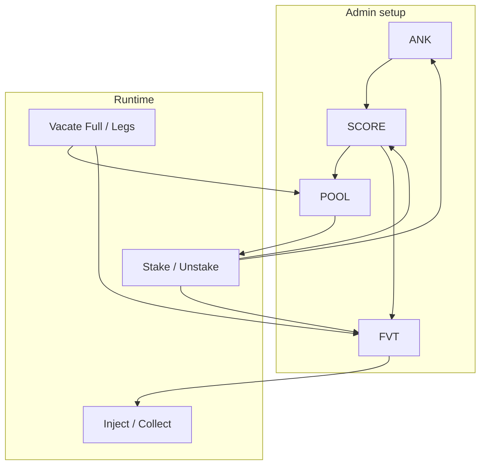

# AQP — Acquisition Pools (system guide)

**AQP** is the Stage 02 earning stack: users **stake** in **pools**, earn **scores** (base / boosted / deb), optional **ANK** promile boost, and **rewards** via Farms, Vaults, and Treasuries (**FVT**). Pool owners can **vacate** (forced unstake) via **VCT**.

**Start here (new global docs)**

| Doc | Use when |
|-----|----------|
| **[README_GLOBAL.md](README_GLOBAL.md)** | Whole architecture, capabilities, Vacate chapter |
| **[README_TALOS_CATALOGUE.md](README_TALOS_CATALOGUE.md)** | Every Talos `AQP-*|C_*` — purpose, limits, phase |
| **[README_HOWTO_FVT.md](README_HOWTO_FVT.md)** | How to build Farm / Vault / Treasury products |

## Module map

| Order | Module | File | Interface | Doc |
|------:|--------|------|-----------|-----|
| 1 | `AQP-ANK` | `01_ANK.pact` | `AcquisitionAnchorsV1` | [README_ANK.md](README_ANK.md) |
| 2 | `AQP-SCORE` | `02_SCORE.pact` | `AcquisitionScoresV1` | [README_SCORE.md](README_SCORE.md) |
| 3 | `AQP-POOL` | `03_AQP.pact` | `AcquisitionPoolsV1` | [README_AQP.md](README_AQP.md) |
| 4 | `AQP-FVT` | `04_FVT.pact` | `AcquisitionFarmsVaultsTreasuriesV1` | [README_FVT.md](README_FVT.md) |
| 5 | `AQP-VCT` | `05_VCT.pact` | `AcquisitionVacateV1` | [README_VACATE_UI.md](README_VACATE_UI.md) |

**Talos client:** `1_SOVEREIGN/STAGE_02/3_Talos/04_TS02-C3.pact` — catalogue above.  
**Bootstrap:** `2_SLAVE/Stage_02/04_AQP-BOOT.pact` — [README_AQP_BOOT.md](../../../2_SLAVE/Stage_02/README_AQP_BOOT.md).  
**Deploy checklist:** [DEPLOY_TEST_MATRIX.md](DEPLOY_TEST_MATRIX.md).

## Implementation status (Aug 2026)

| Layer | Sovereign / Talos | REPL evidence |
|-------|-------------------|---------------|
| **ANK** | Issue/revoke anchors + BoostClass | `[6.2.1]`, BOOT |
| **SCORE** | Issue 0–4, links, DEB, definitions, triplet | `[6.2.2]`, BOOT |
| **POOL** | Issue, Add/RevokeScore, stake gate, TF/OF/SF/NF stake+unstake, sync | `[6.2.3]`, Z, gate |
| **FVT** | Issue FVT, ScoreEntity/Reward links, inject/collect, stake recipes | `[6.2.4]*`, triplet-golden |
| **VCT** | 4× Full + 4× Legs + Abort(pool-id); offline plan helper | `[6.2.5]` via `aqp-deploy-gate` |

**P0 smoke triad:** `REPL/Z.repl` · `REPL/aqp-deploy-gate.repl` · `REPL/triplet-collect-golden.repl`.  
**Honesty:** P0 hot paths green; P1 REJECT/PARTIAL deepeners remain in the matrix — not every scenario is exhaustively audited.

**Stake phases:** [README_STAKE_PHASES.md](README_STAKE_PHASES.md) · **Triplet:** [README_TRIPLET.md](README_TRIPLET.md) · **Deferred notes:** [TEST_DEFERRED.md](TEST_DEFERRED.md)

## Architecture (data flow)

**Dependency rule:** `XE_*` writers do not return OutputCumulator and do not own business `enforce` that belongs in recipe caps — see OuronetInformational skills (`ouronet-x-writes-ignis`, `ouronet-aqp-score-links`).

## OURO LP onboarding (short)

Full checklist: [README_HOWTO_FVT.md § Farm](README_HOWTO_FVT.md#1-farm--single-ouro-lp-minimal) and [README_GLOBAL.md](README_GLOBAL.md).

1. Issue Farm FVT (`common-denominator` = full OURO DPTF id) + reward links.  
2. Per LP: issue class-0 scores (triplet) → class-0 pool → AddScore ×3 → AddScoreEntity on farm.  
3. Users stake in the **pool**; inject/collect on the **farm**.

## Vacate (short)

Stateless **Full** (1 tx) or **Legs** (N txs, auto-begin, finalize when asset empty). UI dirty-reads inventory and dumps txs. Detail: [README_VACATE_UI.md](README_VACATE_UI.md) · chapter in [README_GLOBAL.md §6](README_GLOBAL.md#6-chapter--vacate-ui--chain).

## Related skills / informational

| Resource | Location |
|----------|----------|
| Pact conventions | `OuronetInformational/` + `.cursor/skills/ouronet-pact-conventions` |
| Stage 02 inventory | `OuronetInformational/ARCHITECTURE/STAGE_02_MODULES.md` |
| REPL layout | `OuronetInformational/ARCHITECTURE/REPL_AND_TESTS.md` |
