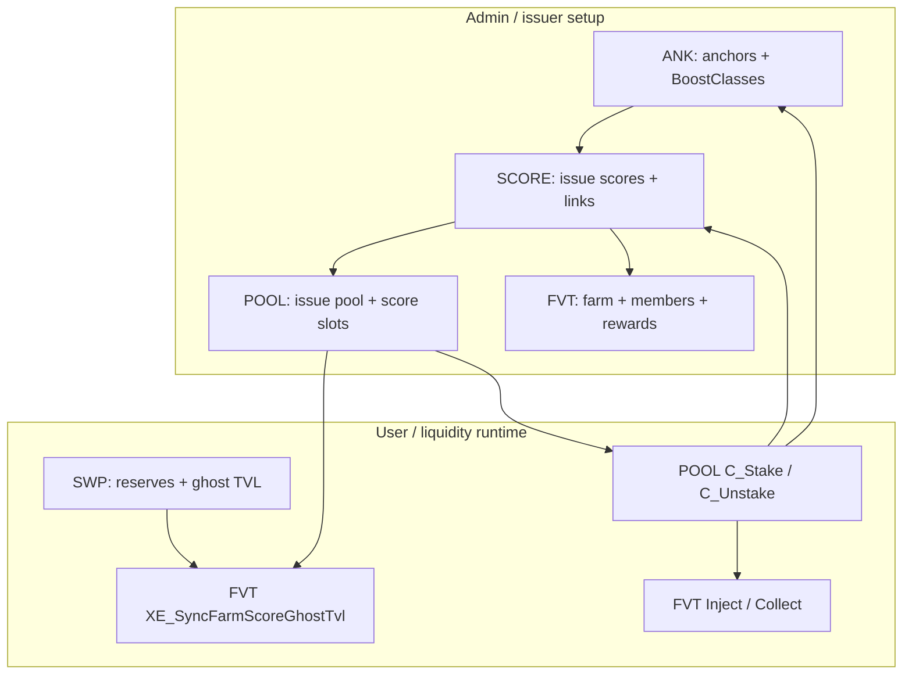

# AQP — Acquisition Pools (system guide)

**AQP** (Acquisition) is the Stage 02 earning stack: users **stake** assets in **pools**, earn **scores** (base / boosted / deb), optional **anchor promile** boost, and **rewards** via Farms, Vaults, and Treasuries (**FVT**). Four sovereign modules live in this folder; provisioning for production is in **`2_SLAVE/Stage_02/04_AQP-BOOT.pact`**.

## Module map

| Order | Module | File | Interface | Doc |
|------:|--------|------|-----------|-----|
| 1 | `AQP-ANK` | `01_ANK.pact` | `AcquisitionAnchorsV1` | [README_ANK.md](README_ANK.md) |
| 2 | `AQP-SCORE` | `02_SCORE.pact` | `AcquisitionScoresV1` | [README_SCORE.md](README_SCORE.md) |
| 3 | `AQP-POOL` | `03_AQP.pact` | `AcquisitionPoolsV1` | [README_AQP.md](README_AQP.md) |
| 4 | `AQP-FVT` | `04_FVT.pact` | `AcquisitionFarmsVaultsTreasuriesV1` | [README_FVT.md](README_FVT.md) |

**Talos client:** `1_SOVEREIGN/STAGE_02/3_Talos/04_TS02-C3.pact` — `AQP-ANK|C_*`, `AQP-SCR|C_*` (patron + IGNIS).

**Bootstrap:** `2_SLAVE/Stage_02/04_AQP-BOOT.pact` — stepped anchor/score/LP-triplet setup for live chain.

## Implementation status

| Layer | Sovereign `C_*` (admin) | Forward `XE_*` (orchestrated) | REPL suite |
|-------|-------------------------|-------------------------------|------------|
| **ANK** | Done | Done (`XE_Update*UserAnchorValues`) | `REPL/Stage_02/[6.2.1]_AQP-ANK.repl` |
| **SCORE** | Done | Done (pool/FVT links + stake deltas) | `REPL/Stage_02/[6.2.2]_AQP-SCORE.repl` |
| **POOL** | `C_Issue`, `C_AddScore` done; `C_Stake` / `C_Unstake` / `C_RevokeScore` placeholders | N/A (caller) | `REPL/Stage_02/[6.2.3]_AQP-POOL.repl` (early) |
| **FVT** | Placeholders | `XE_SyncFarmScoreGhostTvlFromSwp` shell | `REPL/Stage_02/[6.2.4]_AQP-FVT.repl` (early) |

**SCORE (class-0 LP):** `URC_LpAmountToLpDenominatorEquivalent` uses **`SWPL::URC_LpBreakAmounts`** → **lp-denominator** leg (OURO token units at current reserves). **FVT Tier-2** uses **`SWP::UR_StoaValue`** (DWK pool worth) for injection splits — different layer. See [README_SCORE.md](README_SCORE.md).

**Harness:** load `REPL/Stage_02/[6.2]_AQP.repl` (ANK → SCORE → POOL → FVT) or full `REPL/Stage02_Tester.repl`.

## Architecture (data flow)

**Dependency rule:** `XE_*` writers do **not** return `IgnisCollectorV1.OutputCumulator`; `C_*` or Talos builds `UDC_*` cumulators. `XE_*` also do **not** `enforce` business rules that belong in the caller (pool class, FVT membership, etc.) — only caps + writes. See `.cursor/skills/ouronet-x-writes-ignis/SKILL.md` and `ouronet-aqp-score-links/SKILL.md`.

## Multi-LP OURO farm (design summary)

One **Farm FVT** (`common-denominator` = full OURO DPTF id) can unify **many** OURO-denominated LPs. Each LP line is provisioned independently:

| Step | Per LP |
|------|--------|
| Pool | `C_Issue` class-0 pool with that LP’s native `asset-id` |
| Scores | Issue class-0 set (bootstrap: Silver/Bronze/Golden triplet via `AQP-BOOT` Step 6) |
| Employ | `C_AddScore` × scores (≤ 7 slots per pool) |
| Farm | `C_AddScoreLink` × scores on the shared Farm FVT |

Users **stake in pools**; the farm only splits rewards by **S = Σ ghost TVL weights** across enabled `FVT|T|ScoreLink` rows (typically **3 rows per LP** with the triplet). Scores are **not** shared across pools — a new LP always needs new score ids. Hot paths sync ghost TVL **per affected pool** (≤ 7 scores), not across the whole farm.

Full detail: [README_FVT.md](README_FVT.md#multi-lp-farms-one-fvt-many-pools), [README_AQP.md](README_AQP.md#lp-pools-and-multi-lp-farms), [README_SCORE.md](README_SCORE.md#lp-scores-pools-and-fvt-matching).

## End-to-end playbook

### Phase A — Boost rules (optional)

1. Issue anchors via `AQP-ANK|C_Issue*Anchor` (`acnoi=true` creates BoostClass at 2× STOA; `acnoi=false` adds to existing class).
2. BoostClass IDs from inline creation: **`U|DALOS::UDC_Makeid(boost-class-name)`** (not string concat with asset id).
3. Per-user aggregate: **`AQP-ANK::UR_UB|AggregatePromile`** (sum of member anchor promiles; SCORE divides by 1000).

Details: [README_ANK.md](README_ANK.md).

### Phase B — Scoring entities

1. **Issue** score (`C_IssueLiquidityScore` / `C_IssueTrueFungibleScore` / …) — class 0–4.
2. **`C_CreateBoostClassLink`** (optional) → ANK BoostClass; **`C_CreateBoostLink`** (optional) → foreign score for composite LP (surplus-only rows — [README_SCORE.md](README_SCORE.md#foreign-boost-link-composite--split-scores)).
3. **`C_EnableDebBoost`** (optional, one-time) → Elite DEB multiplier on nominal boosted.
4. Classes 3–4: **`C_Issue*ScoreDefinition`** (nonce/trait weights); revisions bump `SCR|T|*DefRevision` — AQP attribution rows refresh lazily on next stake.
5. **`XE_CreateAqpoolLink`** — called from **POOL** when a score fills a pool slot (`aqpool-link` one-time).
6. **`XE_CreateFvtLink`** — called from **FVT** when a score joins a farm/vault (`fvt-link` one-time).

Details: [README_SCORE.md](README_SCORE.md).

### Phase C — Pool

1. **`C_Issue`** — `aqp-class` + canonical `asset-id`.
2. **`C_AddScore`** — assign up to 7 scores (matching class); calls `SCORE::XE_CreateAqpoolLink`.
3. Users **`C_Stake` / `C_Unstake`** (planned): update trackers → for each active score slot → matching `SCORE::XE_UpdateScoreDataFor*` → `ANK::XE_Update*UserAnchorValues` for the staked asset.

Details: [README_AQP.md](README_AQP.md).

### Phase D — Rewards (FVT)

1. **`C_Issue`** — Farm (0), Vault (1), or Treasury (2).
2. Farms: set **`common-denominator`** (full DPTF id shared by member LP scores — e.g. OURO native id).
3. **`C_AddScoreLink`** — once **per score** (not per pool): validate score (`aqpool-link`, class, `lp-denominator` vs farm); persist `swpair`; `SCORE::XE_CreateFvtLink`. Many links on one farm is normal for multi-LP OURO — see [README_FVT.md](README_FVT.md#multi-lp-farms-one-fvt-many-pools).
4. **`C_AddRewardLink`** — one `FVT|T|RPS|Global` row per reward DPTF.
5. **`C_Inject` / `C_Collect`** — farm path uses **two-tier RPS** (ghost TVL weights + deb-score user split).

**Liquidity / ghost TVL order** (same tx when wired):

1. SWP mutates reserves → updates ghost TVL.
2. `SWP::XE_RefreshGhostTvlForSwpair`.
3. POOL calls `FVT::XE_SyncFarmScoreGhostTvlFromSwp` per linked `(fvt-id, score-id)` (≤7 per pool).
4. Inject / stake / collect per [README_FVT.md](README_FVT.md).

Details: [README_FVT.md](README_FVT.md).

### Phase E — Production bootstrap

`AQP-BOOT` steps (after KBN / DemiPad deps):

| Step | Function | Effect |
|------|----------|--------|
| 1 | `C_Step1_CreateBunnySet` | KBN bunny set |
| 2 | `C_Step2_CreateSnakePowerAnchorClasses` | Bronze/Silver/Golden snake-power anchors |
| 3 | `C_Step3_CreateBoosterAnchorClasses` | Unity / Stoa / Vesta boosters |
| 4 | `C_Step4_CreateCoreScores` | Core SF/NF scores |
| 5 | `C_Step5_CreateSubsidiaryScores` | Subsidiary scores |
| 6 | `C_Step6_CreateOuroLpTriplet` | Silver/Bronze/Golden LP scores + boost-class + foreign boost-links (scores only — **no pool/FVT wiring**) |
| 7 | *(planned)* `C_Step7_CreatePoolsAndFarmLinks` | Issue **6 class-1 DPTF pools** + attach Step 4–5 scores; issue **1 class-0 LP pool** for mainnet OURO LP + attach Step 6 triplet; issue **one Farm FVT** + `C_AddScoreLink` for every employed score |

**Planned Step 7 pool map (class-1 DPTF):**

| Pool (DH entity) | Scores attached |
|------------------|-----------------|
| DHCodingDivision | TheCodingDivision, SubsidiaryCodingDivision |
| DHBloodshed | Bloodshed, SubsidiaryBloodshed |
| DHCompany | DemiourgosShareholder, DemiourgosSnakes |
| DHWonderCoach | SubsidiaryWonderCoach |
| DHNosferatu | SubsidiaryNosferatu |
| DHBunnies | SubsidiaryBunnies |

Plus a **7th class-0 pool** for the live OURO LP native id and the Step 6 triplet. A **second OURO LP** later repeats pool + triplet issuance + farm links — it does not reuse the first LP’s score ids.

REPL: `TX-SCORE-08` … `TX-SCORE-10` in `[6.2.2]_AQP-SCORE.repl`.

## Link fields (one-time, `BAR` → value)

On **`SCR|T|Score`** (SCORE owns writes; pool/FVT call `XE_*`):

| Field | Set by | Purpose |
|-------|--------|---------|
| `boost-class-link` | `C_CreateBoostClassLink` | ANK BoostClass for promile |
| `boost-link` | `C_CreateBoostLink` | Foreign score base for composite boosting |
| `aqpool-link` | `XE_CreateAqpoolLink` | Employing pool |
| `fvt-link` | `XE_CreateFvtLink` | Aggregating FVT |

Immutability: fields marked `[.]` / `[..]` in schemas must not change after users have positions; migrate by issuing a new score and rewiring pool/FVT.

## Score triple (per user)

For `(ouronet-account, pool-id, score-id)` in **`SCR|T|UserScore`**:

- **base** — this score’s LP/asset weight.
- **boosted** — base × (aggregate promile / 1000), or surplus over foreign base if `boost-link` set.
- **deb** — nominal boosted × Elite DEB if `deb-boost`, same foreign surplus rules.

Farms split injected rewards: **Tier 2** by ghost TVL tranche weight; **Tier 1** by user **deb-score** inside the tranche.

## Related docs and skills

| Resource | Location |
|----------|----------|
| Module deep-dives | `README_ANK.md`, `README_SCORE.md`, `README_AQP.md`, `README_FVT.md` |
| Stage 02 inventory | `OuronetInformational/ARCHITECTURE/STAGE_02_MODULES.md` |
| SCORE link patterns | `.cursor/skills/ouronet-aqp-score-links/SKILL.md` |
| `enforce` style | `.cursor/skills/ouronet-pact-enforce/SKILL.md` |
| REPL layout | `OuronetInformational/ARCHITECTURE/REPL_AND_TESTS.md` |

## What to build next

1. **AQP-POOL** — finish `C_RevokeScore`, `C_Stake`, `C_Unstake`; orchestrate SCORE `XE_*` + ANK `XE_*` + FVT ghost-TV sync on LP paths.
2. **AQP-FVT** — implement `C_*` and Tier-2/Tier-1 ACTION pseudocode in `04_FVT.pact`.
3. **AQP-BOOT Step 7** — pools, farm issue, and score links per [Phase E](#phase-e--production-bootstrap).
4. **Integration REPL** — stake/unstake + inject/collect once POOL/FVT are live.
