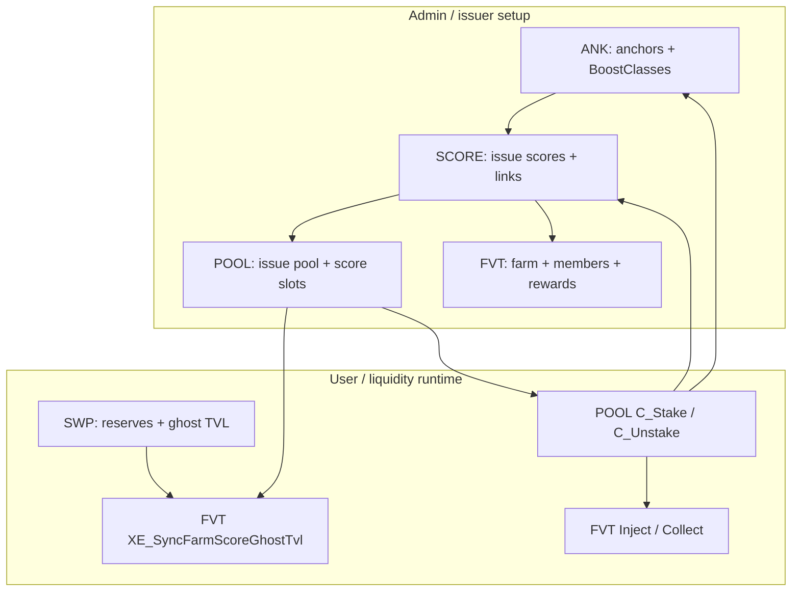
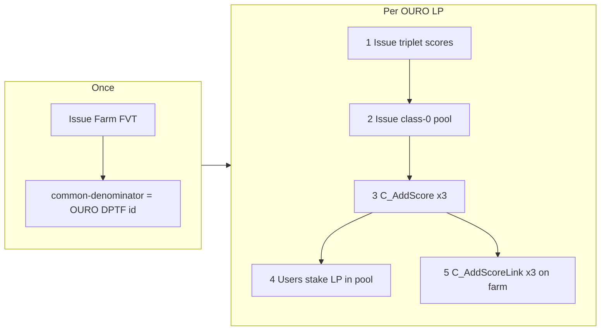

# AQP — Acquisition Pools (system guide)

**AQP** (Acquisition) is the Stage 02 earning stack: users **stake** assets in **pools**, earn **scores** (base / boosted / deb), optional **anchor promile** boost, and **rewards** via Farms, Vaults, and Treasuries (**FVT**). Four sovereign modules live in this folder; provisioning for production is in **`2_SLAVE/Stage_02/04_AQP-BOOT.pact`**.

## Module map

| Order | Module | File | Interface | Doc |
|------:|--------|------|-----------|-----|
| 1 | `AQP-ANK` | `01_ANK.pact` | `AcquisitionAnchorsV1` | [README_ANK.md](README_ANK.md) |
| 2 | `AQP-SCORE` | `02_SCORE.pact` | `AcquisitionScoresV1` | [README_SCORE.md](README_SCORE.md) |
| 3 | `AQP-POOL` | `03_AQP.pact` | `AcquisitionPoolsV1` | [README_AQP.md](README_AQP.md) |
| 4 | `AQP-FVT` | `04_FVT.pact` | `AcquisitionFarmsVaultsTreasuriesV1` | [README_FVT.md](README_FVT.md) |

**Talos client:** `1_SOVEREIGN/STAGE_02/3_Talos/04_TS02-C3.pact` — `AQP-ANK|C_*`, `AQP-SCR|C_*` (patron + IGNIS).

**Bootstrap:** `2_SLAVE/Stage_02/04_AQP-BOOT.pact` — stepped anchor/score/LP-triplet setup for live chain. **Handoff guide (mainnet + REPL id chain):** [README_AQP_BOOT.md](../../../2_SLAVE/Stage_02/README_AQP_BOOT.md).

## Implementation status

| Layer | Sovereign `C_*` (admin) | Forward `XE_*` (orchestrated) | REPL suite |
|-------|-------------------------|-------------------------------|------------|
| **ANK** | Done | Done (`XE_Update*UserAnchorValues`) | `REPL/Stage_02/[6.2.1]_AQP-ANK.repl` |
| **SCORE** | Done | Done (pool/FVT links + stake deltas) | `REPL/Stage_02/[6.2.2]_AQP-SCORE.repl` |
| **POOL** | `C_Issue`, `C_AddScore`, `C_RevokeScore` done; stake/unstake/sync **designed stubs**; `AQP\|T\|BeneficiaryDptfTotal` table live | N/A (caller) | `REPL/Stage_02/[6.2.3]_AQP-POOL.repl` (early) |

**Stake / anchor design (written spec):** [README_AQP.md](README_AQP.md) — three stake paths, beneficiary rules, rollup table, `C_SyncTrueFungibleAnchors`, ANK-before-SCORE order.

**Deferred tests (not in smoke yet):** [TEST_DEFERRED.md](TEST_DEFERRED.md)
| **FVT** | Placeholders | `XE_SyncFarmScoreGhostTvlFromSwp` shell | `REPL/Stage_02/[6.2.4]_AQP-FVT.repl` (early) |

**SCORE (class-0 LP):** `URC_LpAmountToLpDenominatorEquivalent` uses **`SWPL::URC_LpBreakAmounts`** → **lp-denominator** leg (OURO token units at current reserves). **FVT Tier-2** uses **`SWP::UR_StoaValue`** (DWK pool worth) for injection splits — different layer. See [README_SCORE.md](README_SCORE.md).

**Harness:** load `REPL/Stage_02/[6.2]_AQP.repl` (ANK → SCORE → POOL → FVT) or full `REPL/Stage02_Tester.repl`.

## Architecture (data flow)



**Dependency rule:** `XE_*` writers do **not** return `IgnisCollectorV1.OutputCumulator`; `C_*` or Talos builds `UDC_*` cumulators. `XE_*` also do **not** `enforce` business rules that belong in the caller (pool class, FVT membership, etc.) — only caps + writes. See `.cursor/skills/ouronet-x-writes-ignis/SKILL.md` and `ouronet-aqp-score-links/SKILL.md`.

## Multi-LP OURO farm (design summary)

One **Farm FVT** (`common-denominator` = full OURO DPTF id) unifies **many** OURO-denominated LPs. Users **stake in pools**; the farm only splits injected rewards.

See **[OURO LP onboarding flow](#ouro-lp-onboarding-flow-per-lp-line)** below for the step-by-step checklist.

| Step | Per LP |
|------|--------|
| Scores | Issue class-0 triplet (Step 6 pattern; **new score names** for LP #2+) |
| Pool | `C_Issue` class-0 pool with that LP’s native `asset-id` |
| Employ | `C_AddScore` × 3 on that pool |
| Farm | `C_AddScoreLink` × 3 on the shared Farm FVT (once per score) |

Scores are **not** shared across pools. Hot paths sync ghost TVL **per affected pool** (≤ 7 scores), not across the whole farm.

Full detail: [README_FVT.md](README_FVT.md#multi-lp-farms-one-fvt-many-pools), [README_AQP.md](README_AQP.md#lp-pools-and-multi-lp-farms), [README_SCORE.md](README_SCORE.md#lp-scores-pools-and-fvt-matching).

## OURO LP onboarding flow (per LP line)

Use this when adding an OURO-containing LP to the earning stack. **Order matters.**

### Once (first LP only)

| # | Module | Action |
|---|--------|--------|
| 0a | **FVT** | `C_Issue` Farm (class 0); set `common-denominator` = full OURO DPTF id (e.g. `OURO-98c486052a51`) |
| 0b | **FVT** | `C_AddRewardLink` for each reward DPTF you will inject |

### Repeat for every OURO LP (LP #1, LP #2, …)

| # | Module | Action | Boot helper |
|---|--------|--------|-------------|
| **1** | **SCORE** | Issue **3 class-0 scores** (triplet) with same `lp-denominator` = OURO DPTF id; wire boost-class + foreign boost-links (Bronze/Golden → Silver) | Step 6 (first LP fixed names); LP #2+ needs **new score names** |
| **2** | **POOL** | `C_Issue` class-0 pool — `asset-id` = **this LP’s native id** (e.g. `W\|…\|LP-…`) | Step 7 `DHOuroLp` row (first LP) |
| **3** | **POOL** | `C_AddScore` × **3** — employ Silver, Bronze, Golden on that pool | Step 7 |
| **4** | **Users** | `C_Stake` / `C_Unstake` LP into **this pool** → updates `SCR\|T\|UserScore` for all 3 scores | POOL (pending) |
| **5** | **FVT** | `C_AddScoreLink` × **3** — admit each score to the **same** farm; sets `swpair` + ghost TVL weight | FVT (pending) |



### What feeds what at runtime

```
User stakes LP token
  → AQP-POOL (tracker + C_Stake)
  → AQP-SCORE (user base / boosted / deb on each of 3 scores for that pool)
  → AQP-ANK (optional anchor promile refresh)

Farm FVT (does NOT hold LP):
  → reads ghost TVL per ScoreLink.swpair (from SWP)
  → C_Inject splits rewards by S = sum of tranche weights
  → inside each tranche, users earn by deb-score
  → C_Collect pays out
```

### Common mistakes

| Wrong | Right |
|-------|-------|
| Issue pool before scores | **Scores first**, then pool, then `C_AddScore` |
| Reuse Step 6 score ids on LP #2 | **New score issuance** with new names per LP |
| Stake in the farm | Stake in the **pool** |
| One ScoreLink per pool | **One ScoreLink per score** (3 per triplet LP) |
| `lp-denominator` = `"OURO"` ticker | Full DPTF id `OURO-…` |

### Bootstrap mapping (AQP-BOOT)

| Boot step | OURO LP part |
|-----------|----------------|
| **Step 6** | Triplet scores only |
| **Step 7** | `DHOuroLp` pool + `C_AddScore` × 3 (plus DH entity pools) |
| **Step 8** *(planned)* | Farm issue + `C_AddScoreLink` for all employed scores |

## End-to-end playbook

### Phase A — Boost rules (optional)

1. Issue anchors via `AQP-ANK|C_Issue*Anchor` (`acnoi=true` creates BoostClass at 2× STOA; `acnoi=false` adds to existing class).
2. BoostClass IDs from inline creation: **`U|DALOS::UDC_Makeid(boost-class-name)`** (not string concat with asset id).
3. Per-user aggregate: **`AQP-ANK::UR_UB|AggregatePromile`** (sum of member anchor promiles; SCORE divides by 1000).

Details: [README_ANK.md](README_ANK.md).

### Phase B — Scoring entities

1. **Issue** score (`C_IssueLiquidityScore` / `C_IssueTrueFungibleScore` / …) — class 0–4.
2. **`C_CreateBoostClassLink`** (optional) → ANK BoostClass; **`C_CreateBoostLink`** (optional) → foreign score for composite LP (surplus-only rows — [README_SCORE.md](README_SCORE.md#foreign-boost-link-composite--split-scores)).
3. **`C_EnableDebBoost`** (optional, one-time) → Elite DEB multiplier on nominal boosted.
4. Classes 3–4: **`C_Issue*ScoreDefinition`** (nonce/trait weights); revisions bump `SCR|T|*DefRevision` — AQP attribution rows refresh lazily on next stake.
5. **`XE_CreateAqpoolLink`** — called from **POOL** when a score fills a pool slot (`aqpool-link` one-time).
6. **`XE_CreateFvtLink`** — called from **FVT** when a score joins a farm/vault (`fvt-link` one-time).

Details: [README_SCORE.md](README_SCORE.md).

### Phase C — Pool

1. **`C_Issue`** — `aqp-class` + canonical `asset-id`.
2. **`C_AddScore`** — assign up to 7 scores (matching class); calls `SCORE::XE_CreateAqpoolLink`.
3. Users **`C_Stake` / `C_Unstake`** (planned): update trackers → for each active score slot → matching `SCORE::XE_UpdateScoreDataFor*` → `ANK::XE_Update*UserAnchorValues` for the staked asset.

Details: [README_AQP.md](README_AQP.md).

### Phase D — Rewards (FVT)

1. **`C_Issue`** — Farm (0), Vault (1), or Treasury (2).
2. Farms: set **`common-denominator`** (full DPTF id shared by member LP scores — e.g. OURO native id).
3. **`C_AddScoreLink`** — once **per score** (not per pool): validate score (`aqpool-link`, class, `lp-denominator` vs farm); persist `swpair`; `SCORE::XE_CreateFvtLink`. Many links on one farm is normal for multi-LP OURO — see [README_FVT.md](README_FVT.md#multi-lp-farms-one-fvt-many-pools).
4. **`C_AddRewardLink`** — one `FVT|T|RPS|Global` row per reward DPTF.
5. **`C_Inject` / `C_Collect`** — farm path uses **two-tier RPS** (ghost TVL weights + deb-score user split).

**Liquidity / ghost TVL order** (same tx when wired):

1. SWP mutates reserves → updates ghost TVL.
2. `SWP::XE_RefreshGhostTvlForSwpair`.
3. POOL calls `FVT::XE_SyncFarmScoreGhostTvlFromSwp` per linked `(fvt-id, score-id)` (≤7 per pool).
4. Inject / stake / collect per [README_FVT.md](README_FVT.md).

Details: [README_FVT.md](README_FVT.md).

### Phase E — Production bootstrap

**Runbook:** [2_SLAVE/Stage_02/README_AQP_BOOT.md](../../../2_SLAVE/Stage_02/README_AQP_BOOT.md) — step chain, inputs/outputs, `NEXT=` handoff fields, REPL mapping.

`AQP-BOOT` steps (after KBN / DemiPad deps):

| Step | Function | Effect |
|------|----------|--------|
| 1 | `C_Step1_CreateBunnySet` | KBN bunny set |
| 2 | `C_Step2_CreateSnakePowerAnchorClasses` | Bronze/Silver/Golden snake-power anchors |
| 3 | `C_Step3_CreateBoosterAnchorClasses` | Unity / Stoa / Vesta boosters |
| 4 | `C_Step4_CreateCoreScores` | Core SF/NF scores |
| 5 | `C_Step5_CreateSubsidiaryScores` | Subsidiary scores |
| 6 | `C_Step6_CreateOuroLpTriplet` | Silver/Bronze/Golden LP scores + boost-class + foreign boost-links (scores only — **no pool/FVT wiring**) |
| 7 | `C_Step7_CreatePoolsAndScores` | Issue **6 DH pools** (class 3/4 by entity) + attach Step 4–5 scores; issue **1 class-0 LP pool** + Step 6 triplet; FVT links pending |

**Step 7 pool map (aqp-class fixed in boot code):**

| Pool | aqp-class | Staked asset (example REPL id) | Scores attached |
|------|-----------|--------------------------------|-----------------|
| DHCodingDivision | 3 DPSF | `DHCD-98c486052a51` | TheCodingDivision, SubsidiaryCodingDivision |
| DHBloodshed | 4 DPNF | `DHB-98c486052a51` | Bloodshed, SubsidiaryBloodshed |
| DHCompany | 3 DPSF | `E\|DH-98c486052a51` | DemiourgosShareholder, DemiourgosSnakes |
| DHWonderCoach | 3 DPSF | `DHWC-98c486052a51` | SubsidiaryWonderCoach |
| DHNosferatu | 4 DPNF | `DHN-98c486052a51` | SubsidiaryNosferatu |
| DHBunnies | 4 DPNF | `KBN-98c486052a51` | SubsidiaryBunnies |
| DHOuroLp | 0 LP | native LP id | Silver/Bronze/Golden triplet |

REPL: `TX-SCORE-08` … `TX-SCORE-10` in `[6.2.2]_AQP-SCORE.repl`.

## Link fields (one-time, `BAR` → value)

On **`SCR|T|Score`** (SCORE owns writes; pool/FVT call `XE_*`):

| Field | Set by | Purpose |
|-------|--------|---------|
| `boost-class-link` | `C_CreateBoostClassLink` | ANK BoostClass for promile |
| `boost-link` | `C_CreateBoostLink` | Foreign score base for composite boosting |
| `aqpool-link` | `XE_CreateAqpoolLink` | Employing pool |
| `fvt-link` | `XE_CreateFvtLink` | Aggregating FVT |

See **Mutability & lifecycle** below for what may change after set.

## Mutability & lifecycle

Canonical rules for “what can be changed, what cannot, and what to do instead.” Module-specific detail: `README_SCORE.md`, `README_ANK.md`, `README_AQP.md`, `README_FVT.md`.

### Score entity

| Action | Allowed? | Notes |
|--------|----------|-------|
| Issue score | Yes | `C_Issue*` — new deterministic id via `U|DALOS::UDC_Makeid(score-name)`. |
| Delete score | **No** | No revoke/delete on `SCR|T|Score`. Wrong issuance → **issue a new score** with a new name; leave the old row on chain. |
| Rotate owner | Yes | `C_RotateOwnership` when `can-change-owner`. |
| Change control flags | Yes | `C_Control` when `can-upgrade`. |
| Change class / multipliers / models | **No** after issue | `[.]` fields; migrate via new score. |
| Enable DEB boost | Once | `C_EnableDebBoost` — irreversible toggle. |

### Link fields on `SCR|T|Score`

| Field | Slot empty | After set | Revoke / change link? |
|-------|------------|-----------|------------------------|
| `boost-class-link` | `BAR` — no ANK promile | Points at a **BoostClass id** (fixed forever) | **No.** Caps require slot `BAR` at create; no `XE_Revoke*` exists. |
| `boost-link` | `BAR` — use own base for promile math | Points at **another score-id** (fixed forever) | **No.** Same one-time rule; self-link forbidden at create. |
| `aqpool-link` | `BAR` — not employed by a pool | Points at **one pool id** | **Planned:** `XE_RevokeAqpoolLink` from `C_RevokeScore` when pool slot cleared (zero stake, guards TBD). Clears employment only — not a score delete. |
| `fvt-link` | `BAR` — not on a farm/vault | Points at **one FVT id** | **No link revoke in SCORE.** FVT may **toggle** membership rows off; score row keeps `fvt-link` set (see `README_FVT.md`). |

**Design intent:** `boost-class-link` and `boost-link` are **configuration immutables** — set during bootstrap (e.g. Step 6) before pool employ. They define *how* weights are computed, not *where* the score is used. Employment (`aqpool-link`) and aggregation (`fvt-link`) are separate lifecycle layers.

### Indirect knobs (without changing score links)

**BoostClass (`boost-class-link` target):**

- ANK **`C_RevokeAnchor`** → removes anchors from the class; user promile drops as anchors go inactive.
- ANK **`C_RevokeBoostClass`** → sets `class-active: false` when the class has **zero** anchors (empty class only).
- At **link create**, SCORE requires `AQP-ANK::UR_BC|Active` — you cannot wire a new score to an already-inactive class.
- At **stake time**, SCORE reads `UR_UB|AggregatePromile` for the linked class id; it does **not** re-check `class-active`. Effective boost fades when anchors are revoked, not when the link string changes.

**Foreign score (`boost-link` target):**

- No SCORE API to clear or retarget `boost-link`.
- Dependent scores (e.g. Bronze/Golden → Silver) keep the pointer even if Silver is removed from the pool; stake math reads the foreign row at `(account, pool-id, boost-score-id)` — plan revokes so dependents are handled first, or accept stale/zero foreign base.
- Wrong wiring → issue new scores and re-run pool/FVT wiring; do not add revoke paths for `boost-link`.

### When something was set up wrong

1. Issue **new** score(s) with new name(s).
2. Set boost links on the new rows (Step 6 pattern).
3. `C_AddScore` on the pool; `C_AddScoreLink` on the farm.
4. Optionally `C_RevokeScore` on old pool slots (once implemented) — old score ids remain on chain but are unemployed.

Do **not** add `C_RevokeBoostClassLink` / `C_RevokeBoostLink` unless product policy explicitly requires mid-life retargeting (not current design).

## Score triple (per user)

For `(ouronet-account, pool-id, score-id)` in **`SCR|T|UserScore`**:

- **base** — this score’s LP/asset weight.
- **boosted** — base × (aggregate promile / 1000), or surplus over foreign base if `boost-link` set.
- **deb** — nominal boosted × Elite DEB if `deb-boost`, same foreign surplus rules.

Farms split injected rewards: **Tier 2** by ghost TVL tranche weight; **Tier 1** by user **deb-score** inside the tranche.

## Related docs and skills

| Resource | Location |
|----------|----------|
| **AQP-BOOT handoff (mainnet + REPL)** | `2_SLAVE/Stage_02/README_AQP_BOOT.md` |
| Module deep-dives | `README_ANK.md`, `README_SCORE.md`, `README_AQP.md`, `README_FVT.md` |
| Stage 02 inventory | `OuronetInformational/ARCHITECTURE/STAGE_02_MODULES.md` |
| SCORE link patterns | `.cursor/skills/ouronet-aqp-score-links/SKILL.md` |
| `enforce` style | `.cursor/skills/ouronet-pact-enforce/SKILL.md` |
| REPL layout | `OuronetInformational/ARCHITECTURE/REPL_AND_TESTS.md` |

## What to build next

1. **AQP-POOL** — finish `C_RevokeScore`, `C_Stake`, `C_Unstake`; orchestrate SCORE `XE_*` + ANK `XE_*` + FVT ghost-TV sync on LP paths.
2. **AQP-FVT** — implement `C_*` and Tier-2/Tier-1 ACTION pseudocode in `04_FVT.pact`.
3. **AQP-BOOT Step 7** — pools, farm issue, and score links per [Phase E](#phase-e--production-bootstrap).
4. **Integration REPL** — stake/unstake + inject/collect once POOL/FVT are live.
