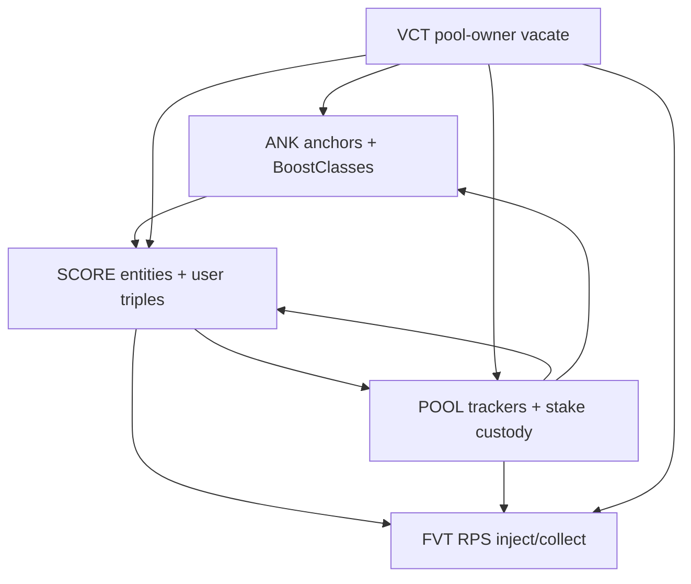

# AQP Global Architecture

**Audience:** product, UI, and operators who need one map of the Acquisition stack — capabilities, construction flow, and Vacate — without reading every module README first.

**Code home:** `1_SOVEREIGN/STAGE_02/2_Core/03_AQP/`  
**Talos client:** `1_SOVEREIGN/STAGE_02/3_Talos/04_TS02-C3.pact` (`TalosStageTwo_ClientThreeV1`)  
**Bootstrap:** `2_CITIZEN/4_VaultsMinter/04_AQP-BOOT.pact` + [README_AQP_BOOT.md](../../../2_CITIZEN/4_VaultsMinter/README_AQP_BOOT.md)

**Companion docs**

| Doc | Role |
|-----|------|
| [README_TALOS_CATALOGUE.md](README_TALOS_CATALOGUE.md) | Every Talos `AQP-*|C_*`: purpose, limits, construction phase |
| [README_HOWTO_FVT.md](README_HOWTO_FVT.md) | Top-to-bottom how to build Farm / Vault / Treasury + pools |
| [README_VACATE_UI.md](README_VACATE_UI.md) | Vacate UI dirty-read → Legs dump (detail) |
| Module deep-dives | `README_ANK`, `README_SCORE`, `README_AQP`, `README_FVT`, `README_STAKE_PHASES`, `README_TRIPLET` |
| [DEPLOY_TEST_MATRIX.md](DEPLOY_TEST_MATRIX.md) | DeployXY scenario checklist + evidence |

---

## 1. What AQP is

Users **stake** assets into **pools**. Each pool employs up to **7 scores**. Scores produce **base / boosted / deb** weight. Optional **ANK anchors** add promile boost. **FVT** (Farm / Vault / Treasury) registers scores and **reward DPTFs**, then **inject / collect** via RPS.

Users never stake “into the farm.” They stake into a **pool**. The FVT only accounts and pays rewards.

| Module | Job |
|--------|-----|
| **AQP-ANK** | BoostClasses + anchors → user aggregate promile |
| **AQP-SCORE** | Score issuance, links, user base/boosted/deb, definitions |
| **AQP-POOL** | Pool issue, score slots, stake/unstake trackers, sync repair |
| **AQP-FVT** | Farm/Vault/Treasury, score/reward links, inject/collect, stake recipes |
| **AQP-VCT** | Pool-owner forced unstake (Full + Legs) |

---

## 2. Capability map (what exists today)

| Area | Capability | Status |
|------|------------|--------|
| Anchors | Issue TF/SF/NF/set anchors; revoke anchor/empty BoostClass | Ready |
| Scores | Issue class 0–4; boost-class / boost-link; DEB; SF/NF definitions; triplet bookkeeping | Ready |
| Pools | Issue class 0–4; Add/RevokeScore; enable/disable stake | Ready |
| Stake / unstake | TF, OF, DPSF, DPNF via Talos → FVT stake flows | Ready (P0 smoke) |
| Sync | Pool-agnostic TF/SF/NF anchor repair | Ready |
| FVT admin | Issue Farm/Vault/Treasury; AddScoreEntity; AddRewardLink; toggles; mosaic; multiplet family | Ready |
| Inject / Collect | Farm two-tier RPS; vault/treasury paths; triplet collect | Ready (golden + gate) |
| Vacate | 4× Full + 4× Legs + Abort(pool-id); UI offline plan helper | Ready (Legs architecture) |

**Honest testing:** DeployXY **P0** triad is green (`Z.repl`, `aqp-deploy-gate.repl`, `triplet-collect-golden.repl`). Not every matrix REJECT/PARTIAL is closed — see `DEPLOY_TEST_MATRIX.md`.

---

## 3. Classes (pool × score × FVT)

### Pool `aqp-class`

| Class | Staked asset shape |
|------:|--------------------|
| 0 | Native LP (+ optional Z\| orto LP leg) |
| 1 | Non-LP DPTF (+ optional Z\|/H\| DPOF satellites) |
| 2 | Standalone circulating DPOF |
| 3 | DPSF collectable |
| 4 | DPNF collectable |

### Score class

| Class | Meaning |
|------:|---------|
| 0 | LP / liquidity |
| 1 | TrueFungible |
| 2 | OrtoFungible |
| 3 | SemiFungible |
| 4 | NonFungible |

Pool employment requires **matching** score class to pool class (triplet LP uses three class-0 scores on a class-0 pool).

### FVT `fvt-class`

| Class | Type | Notes |
|------:|------|-------|
| 0 | Farm | Needs `common-denominator` (full DPTF id); two-tier ghost-TVL + deb |
| 1 | Vault | Non-LP scores; single-tier style accounting |
| 2 | Treasury | General aggregator |

---

## 4. Construction flow (one page)

Order is enforced by one-time links (`boost-*`, `aqpool-link`, `fvt-link`).

1. **Optional ANK** — BoostClasses + anchors.
2. **SCORE** — issue score(s); optional boost-class-link, boost-link, EnableDebBoost; SF/NF definitions if needed.
3. **POOL** — `C_Issue` → `C_AddScore` (≤7) → EnablePoolStake.
4. **FVT** — `C_Issue` → `C_AddRewardLink` → `C_AddScoreEntity` (type 1 = score, type 3 = triplet).
5. **Users** — stake / unstake / collect; operators inject.
6. **Ops vacate** — Full or Legs when pool must return all inventory to owners.

Detailed Farm/Vault/Treasury recipes: [README_HOWTO_FVT.md](README_HOWTO_FVT.md).  
Every Talos entry: [README_TALOS_CATALOGUE.md](README_TALOS_CATALOGUE.md).

---

## 5. Runtime money paths

### Stake / unstake

Custody moves asset ↔ `AQP|SC_NAME`. FVT recipe phases unwind/apply SCORE, ANK, RPS. See [README_STAKE_PHASES.md](README_STAKE_PHASES.md).

| Asset | Stake rule | Unstake rule |
|-------|------------|--------------|
| TF | Partial amount OK | Partial OK |
| OF | Whole nonce | Whole nonce |
| DPSF/DPNF | Nonce quantities | Partial qty OK |

**Owner vs beneficiary:** transfer always to **owner**. Beneficiary is the SCORE/ANK/RPS key (self-stake when equal).

### Inject / collect

- **Inject:** patron → vault custody; advance RPS `G` (farm: `G += R/S` when `S>0`).
- **Collect:** `CC_Collect(patron, fvt-id, score-entity-type, score-entity-id, reward-dptf-id)` — type **1** = single score, **3** = triplet family member path.

### Ghost TVL (farms)

SWP holds ghost TVL; pool orchestration syncs enabled ScoreLinks. Inject does **not** scan all pools — it uses farm-wide `S = Σ W_i`.

---

## 6. Chapter — Vacate (UI + chain)

Pool-owner **forced unstake**: same unwind as unstake, owner receives assets back. Detail: [README_VACATE_UI.md](README_VACATE_UI.md).

### Two variants

| Variant | When | Talos |
|---------|------|-------|
| **Full** | Fits one ~2M-gas tx | `AQP-POOL\|C_FullVacate*` (Legs from plan N=1) |
| **Legs** | Needs N txs | `AQP-POOL\|C_Vacate*Legs(..., finalize)` |

### Stateless Legs model

Full construction recipe (exact reads → Full try → Legs verify/shrink → Talos args):  
[README_VACATE_UI.md §1](README_VACATE_UI.md#1-ui-vacate-engine-canonical-construction).

1. UI **dirty-reads** inventory (`AQP-VCT.URD_Vacate*Inventory`) + unit-count helpers.
2. Prefer **Full** if ~2M gas; else split with `URHC_BuildVacateSlicePlan` / `VACATE-GAS-MAX-*`, verifying each leg.
3. UI presents N txs; user confirms **dump on chain**.
4. First successful Legs tx **auto-begins** (`vacate-in-progress`, stake off).
5. Last intended tx sets `finalize=true` — succeeds only if **that asset** unit count is 0 → stake on.
6. If some txs fail, re-read remaining, re-split (e.g. 8 instead of 7), continue.

**Abort:** `C_AbortVacate(pool-id)` clears flag; stake stays disabled until `C_EnablePoolStake`.

**LP / Farm pools:** TF and OF streams are **independent** — UI builds Full/Legs for both when both have inventory.

**Gas ceilings (profiled):** TF ≤24 owners; OF ≤33 nonces; DPSF ≤29; DPNF ≤30 per Legs tx.

---

## 7. Immutables (do not fight the design)

| Thing | Rule |
|-------|------|
| Score delete | **No** — issue a new score name |
| `boost-class-link` / `boost-link` | One-time |
| `aqpool-link` | One score → one pool |
| `fvt-link` | One score → one FVT (many scores → same FVT OK) |
| Multi-LP farm | New pool + **new** scores + new ScoreEntity links — never reuse scores across pools |

---

## 8. Smoke / DeployXY

| Loader | Role |
|--------|------|
| `REPL/Z.repl` | AQP-FAST Stage02 smoke |
| `REPL/aqp-deploy-gate.repl` | Z + `[6.2.5]` vacate suite |
| `REPL/triplet-collect-golden.repl` | MULTIPLET farm collect + LP dual-stream vacate |

Plan of record: [DEPLOY_TEST_MATRIX.md](DEPLOY_TEST_MATRIX.md).

---

## 9. What this doc is not

Module schema encyclopedias live in per-module READMEs. This file is the **system map**. For “call this Talos function with these args,” use the catalogue; for “build a staking product,” use the how-to.
